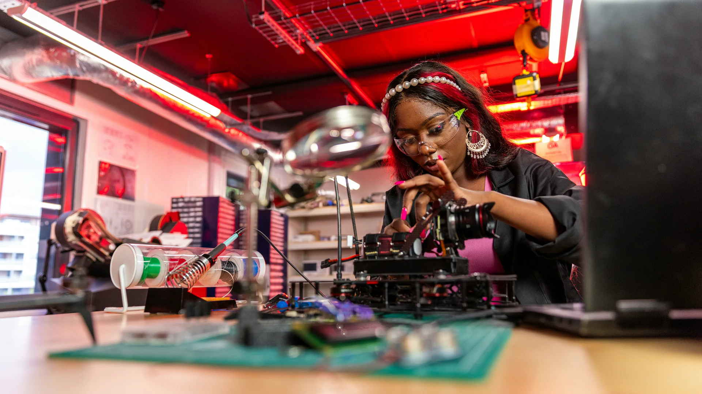
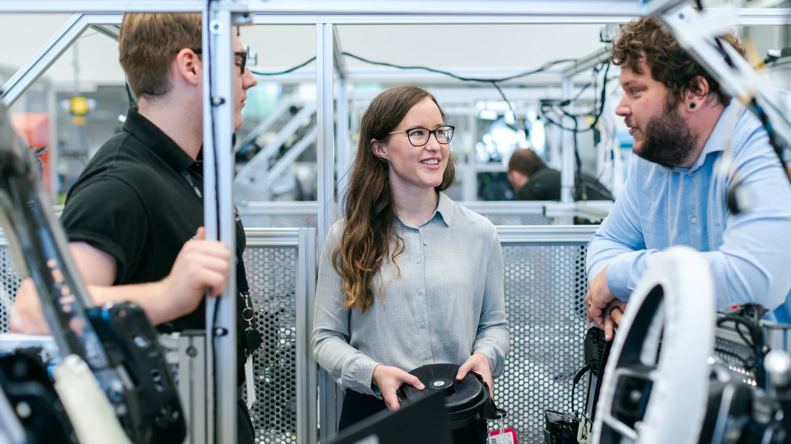
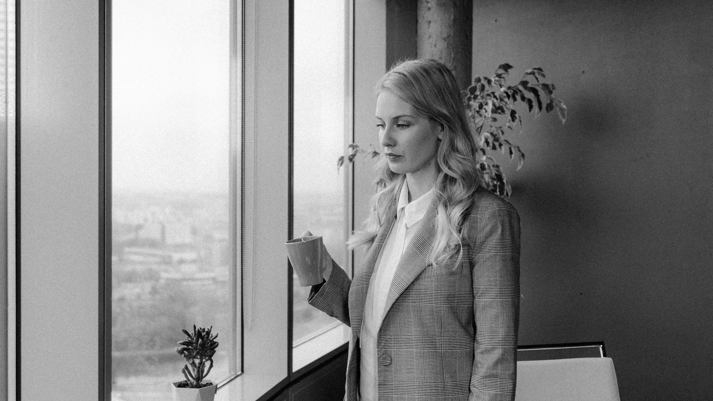
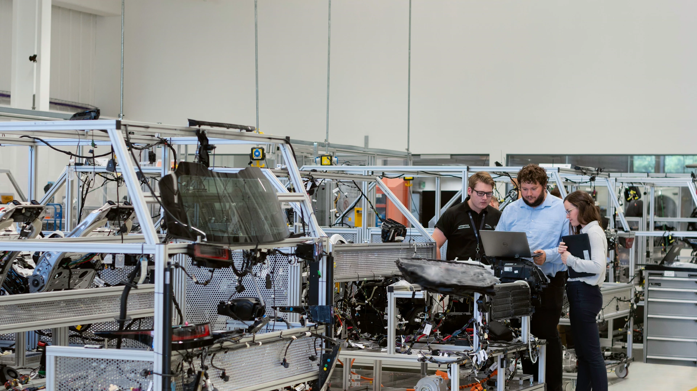
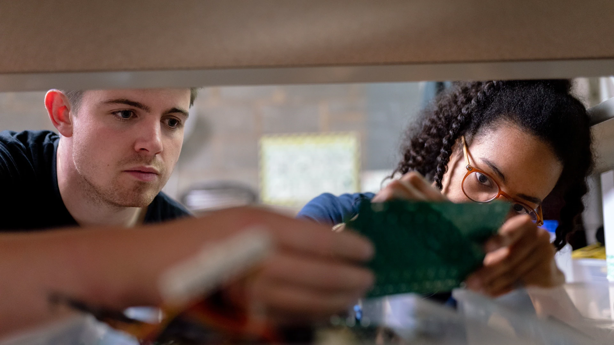
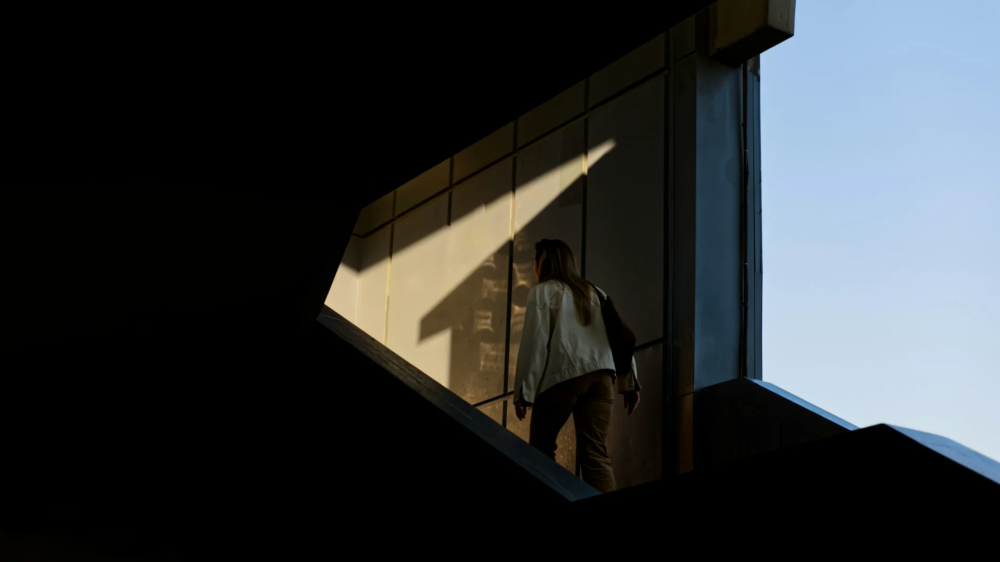

# Solution image candidate pool · 2026-09

This is a review-only shortlist for the 19 active solution image slots, with seven choices per slot and 133 candidates in the original pool. Two additional web batches are listed below: 20 candidates from the first batch and 18 from the second (171 candidates in total). It does not select a winner and does not change any runtime image reference.

## New candidate image previews

The new candidates previously appeared only as source links. They are now embedded below as remote 640 px previews for direct visual comparison. The linked Pexels page remains the source record; these previews are not production assets.

| Candidate | Preview | Candidate | Preview |
| --- | --- | --- | --- |
| 8278898 · strategy workshop |  | 7710157 · strategy planning |  |
| 32074897 · document review |  | 23496663 · team collaboration |  |
| 7495608 · goal workshop |  | 7970851 · evidence review |  |
| 5429002 · team discussion |  | 7870025 · reflection notes |  |
| 6929217 · learning notes |  | 8112113 · expert review |  |
| 30535635 · planning notes |  | 6446233 · task notes |  |
| 18870246 · one-to-one learning |  | 12899118 · career reflection |  |
| 6326285 · professional planning |  | 5705502 · career journaling |  |
| 36569261 · reflective development |  | 5955105 · coaching conversation |  |
| 38939130 · practical demonstration |  | 19224452 · production roles |  |
| 3183153 · survey analysis |  | 36733316 · strategy meeting |  |
| 4990536 · report chart |  | 9242850 · workshop skills |  |
| 6773652 · creative office |  | 8853403 · colleague conversation |  |
| 9432941 · chart discussion |  | 19895721 · workshop team |  |
| 8117437 · strategy discussion |  | 6773846 · office collaboration |  |
| 16850257 · carpentry teaching |  | 3860928 · cross-generational plan |  |
| 36731538 · pottery instruction |  | 7845162 · office discussion |  |
| 5668521 · decision discussion |  | 8837556 · document coaching |  |
| 7651927 · career discussion |  | 8068161 · team planning |  |

## Fresh web candidates · 2026-09-09

The following additional Pexels candidates were found after the original A–G pool. They are review-only suggestions, not runtime assets. Each source page should be checked again for final resolution, people/brand context, responsive cropping, and provenance before download.

| Candidate | Suggested use | Why it may fit |
| --- | --- | --- |
| [People brainstorming in a meeting · Pexels 8278898](https://www.pexels.com/photo/people-brainstorming-in-a-meeting-8278898/) | SWOT / strategy | Diverse team, charts, and plans make evidence-based comparison visible. |
| [Colleagues having a business meeting · Pexels 7710157](https://www.pexels.com/photo/colleagues-having-a-business-meeting-7710157/) | Strategy / management models | Strategic planning without an industrial-equipment setting. |
| [Diverse team collaborating on project · Pexels 32074897](https://www.pexels.com/photo/diverse-team-collaborating-on-project-32074897/) | SWOT / 360 feedback | Document review and multiple viewpoints are immediately legible. |
| [Young diverse team in modern office · Pexels 23496663](https://www.pexels.com/photo/office-team-working-by-table-23496663/) | Strategy / team roles | Casual collaborative planning with a less staged composition. |
| [People brainstorming in the office · Pexels 7495608](https://www.pexels.com/photo/people-doing-brainstorming-in-the-office-7495608/) | SMART / development | Goal-setting, digital presentation, and inclusive workshop cues. |
| [Colleagues having a meeting · Pexels 7970851](https://www.pexels.com/photo/colleagues-having-a-meeting-7970851/) | Strategy / feedback | Overhead document review gives a clear evidence-and-discussion frame. |
| [Colleagues team-building · Pexels 5429002](https://www.pexels.com/photo/colleagues-having-a-team-building-5429002/) | Belbin / 360 feedback | Group dynamics and complementary participation without a technical lab. |
| [Person writing on a notebook · Pexels 7870025](https://www.pexels.com/photo/person-writing-on-a-notebook-7870025/) | Self-assessment | Quiet reflection and written evidence in a neutral setting. |
| [Student writing notes · Pexels 6929217](https://www.pexels.com/photo/student-writing-notes-on-her-notebook-6929217/) | Self-assessment / development | Close-up note-taking emphasizes reflection and learning. |
| [Professional lawyer writing on notebook · Pexels 8112113](https://www.pexels.com/photo/professional-lawyer-writing-on-a-notebook-8112113/) | Self-assessment | Expert review of documents suggests judgment and specialist knowledge; final workplace fit needs review. |
| [Close-up person writing in notebook · Pexels 30535635](https://www.pexels.com/photo/close-up-of-person-writing-in-notebook-30535635/) | SMART / self-assessment | Minimal composition; card text space and crop still need visual review. |
| [Business professional taking notes · Pexels 6446233](https://www.pexels.com/photo/a-person-writing-in-a-notebook-6446233/) | SMART / planning | Notes, schedule, and task organization are easy to understand. |
| [Teacher with student · Pexels 18870246](https://www.pexels.com/photo/teacher-with-a-student-in-a-classroom-18870246/) | Skills gap / coaching | One-to-one guidance and learning relationship are explicit. |
| [Man taking notes by window · Pexels 12899118](https://www.pexels.com/photo/man-taking-notes-in-notebook-12899118/) | Career coaching / self-assessment | Individual reflection; composition and crop still need visual review. |
| [Professional writing on document · Pexels 6326285](https://www.pexels.com/photo/photo-of-man-writing-on-document-6326285/) | Career / goal planning | Personal responsibility, planning, and progress recording. |
| [Senior business woman journaling · Pexels 5705502](https://www.pexels.com/photo/senior-business-woman-looking-away-while-writing-on-a-journal-5705502/) | Career development | Experienced professional reflecting on growth and next steps. |
| [Woman writing in notebook · Pexels 36569261](https://www.pexels.com/photo/woman-writing-in-notebook-on-dark-background-36569261/) | Development / reflection | A darker reflective direction; contrast and crop still need visual review. |
| [Man and woman meeting in office · Pexels 5955105](https://www.pexels.com/photo/a-man-and-woman-having-a-meeting-in-the-office-5955105/) | GROW / career coaching | A focused two-person conversation with visible listening and response. |
| [Cooking class demonstration · Pexels 38939130](https://www.pexels.com/photo/cooking-class-demonstration-in-modern-kitchen-38939130/) | Skills gap / workplace skills | Demonstration and learner observation make practical skill transfer visible. |
| [Film crew working on set · Pexels 19224452](https://www.pexels.com/photo/crew-working-on-filmset-19224452/) | Belbin / McKinsey 7S | Camera, sound, and production roles show complementary work toward one output. |

## Fresh web candidates · second batch · 2026-09-10

These candidates are also review-only. They were selected to add more visual directions beyond the existing meeting, notebook, and engineering scenes; final crop and provenance checks are still required.

| Candidate | Suggested use | Why it may fit |
| --- | --- | --- |
| [Colleagues looking at survey sheet · Pexels 3183153](https://www.pexels.com/photo/colleagues-looking-at-survey-sheet-3183153/) | SWOT / strategy | Charts, survey results, and multiple devices make evidence review explicit. |
| [Team discussing sales strategy · Pexels 36733316](https://www.pexels.com/photo/business-meeting-team-discussing-sales-strategy-36733316/) | Strategy / management models | Charts and strategic discussion provide a more executive visual direction. |
| [Report chart on clipboard · Pexels 4990536](https://www.pexels.com/photo/report-chart-on-a-clipboard-4990536/) | SWOT / feedback | A close evidence-and-report composition can work where people should remain secondary. |
| [People working in workshop · Pexels 9242850](https://www.pexels.com/photo/people-working-in-a-workshop-9242850/) | Skills gap / workplace skills | Practical tools, training, and prototype work connect capability to real tasks. |
| [People creative office working · Pexels 6773652](https://www.pexels.com/photo/people-creative-office-working-6773652/) | Career / development | Diverse professionals exchange ideas in a less formal development setting. |
| [Woman conversation with colleague · Pexels 8853403](https://www.pexels.com/photo/woman-having-a-conversation-with-her-colleague-8853403/) | GROW / coaching | A warmer two-person work conversation with visible engagement. |
| [Two men analyzing charts · Pexels 9432941](https://www.pexels.com/photo/desk-working-men-writing-9432941/) | SWOT / GROW | Shared papers and charts connect analysis with collaborative problem solving. |
| [Multicultural workshop team · Pexels 19895721](https://www.pexels.com/photo/people-sitting-at-desk-in-workshop-and-talking-19895721/) | Belbin / McKinsey 7S | People, laptops, and tools show different contributions around one project. |
| [Colleagues discussing strategy · Pexels 8117437](https://www.pexels.com/photo/colleagues-having-a-discussion-8117437/) | Strategy / feedback | Binders and discussion suggest organized review without a technical setting. |
| [Diverse office discussion · Pexels 6773846](https://www.pexels.com/photo/colleagues-discussing-in-the-office-6773846/) | 360 feedback / team roles | Multiple colleagues and viewpoints support a people-centered visual. |
| [Carpenter teaching in workshop · Pexels 16850257](https://www.pexels.com/photo/carpenter-teaching-two-young-boys-in-the-workshop-16850257/) | Skills gap / development | Demonstration, observation, and practical learning are immediately readable. |
| [Different-age colleagues work plan · Pexels 3860928](https://www.pexels.com/photo/diverse-colleagues-of-different-ages-discussing-work-plan-and-current-issues-in-office-3860928/) | Career coaching / development | Cross-generational discussion makes experience transfer visible. |
| [Pottery class instructor · Pexels 36731538](https://www.pexels.com/photo/pottery-class-with-instructor-guiding-student-36731538/) | Skills gap / coaching | Direct instruction and hands-on practice offer a non-industrial alternative. |
| [Woman working in office · Pexels 7845162](https://www.pexels.com/photo/a-woman-working-in-the-office-7845162/) | Career / self-assessment | A quieter professional interaction can support reflection and planning. |
| [Multiethnic colleagues discussing work · Pexels 5668521](https://www.pexels.com/photo/multiethnic-colleagues-discussing-work-in-office-5668521/) | Leadership / strategy | Document discussion and decision-making are visible without a staged presentation. |
| [Man discussing documents · Pexels 8837556](https://www.pexels.com/photo/man-discussing-documents-to-a-coworker-8837556/) | Feedback / coaching | One colleague explains evidence while another receives and considers it. |
| [Young business people discussing · Pexels 7651927](https://www.pexels.com/photo/young-business-people-sitting-and-discussing-inside-an-office-room-7651927/) | Career / goals | Conversation, planning, and negotiation cues fit development-oriented methods. |
| [Diverse group discussing plans · Pexels 8068161](https://www.pexels.com/photo/people-having-a-discussion-at-the-office-8068161/) | 360 feedback / Belbin | Mixed perspectives and shared planning create a clear team-level scene. |

## Review convention

- `A` is the image currently used by the page and is retained as the visual baseline.
- `B` through `G` are newly screened real-photo alternatives from Pexels.
- `Decision` remains `pending` for every slot. A later review can choose `A`, `B`, `C`, `D`, `E`, `F`, or `G` independently for each slot.
- Screening considered semantic fit, visual differentiation, visible logos or text, and survivability in 16:9, square-card, and narrow responsive crops.
- The remote previews below are for review only. No alternative original has been added to the production asset folder.

## License boundary

- Current `A` assets retain the audited Pexels or free Unsplash source recorded in the family provenance documents.
- New `B` through `G` candidates use the [Pexels License](https://www.pexels.com/license/). Pexels permits free website use and modification; identifiable people or brands must not be presented as endorsing the product.
- If an alternative is selected later, its full-resolution original, final crop, hash, alt text, and focal point still need to be recorded before deployment.

## Strategy and analysis

### Visual comparison

| Slot | A · current | B · alternative | C · alternative | D · alternative | E · alternative | F · alternative | G · alternative |
| --- | --- | --- | --- | --- | --- | --- | --- |
| Strategy category |  |  |  |  |  |  |  |
| SWOT analysis |  |  |  |  |  |  |  |
| VRIO analysis |  |  |  |  |  |  |  |
| McKinsey 7S |  |  |  |  |  |  |  |
| Skills gap analysis |  |  |  |  |  |  |  |

### Candidate notes

| Slot | Candidate | Source | Visual direction | Crop and content risk |
| --- | --- | --- | --- | --- |
| Strategy category | A | [RONNAKORN TRIRAGANON · Unsplash](https://unsplash.com/photos/construction-workers-examine-plans-on-site-ep99OyLRUd4) | Evidence-led strategy in a real operating environment. | Low crop risk; clear context, but safety clothing makes the story industry-specific. |
|  | B | [Vitaly Gariev · Pexels 36733318](https://www.pexels.com/photo/business-meeting-presentation-with-team-interaction-36733318/) | Clear executive strategy discussion around charts. | Low 16:9 risk; more familiar corporate-stock language than A. |
|  | C | [Sora Shimazaki · Pexels 5668778](https://www.pexels.com/photo/black-businesswoman-reporting-financial-results-at-meeting-5668778/) | Visible leadership, evidence, and decision communication. | Medium wide-crop risk because the source is vertical; keep the presenter and listener reaction together. |
|  | D | [Alexander Suhorucov · Pexels 6457516](https://www.pexels.com/photo/black-woman-pointing-away-at-skyscrapers-and-talking-with-colleague-6457516/) | Strategic horizon, external context, and direction choice appear in one editorial cityscape. | Low wide-crop risk; faces remain silhouetted and square crops trim the outer bodies. |
|  | E | [Sora Shimazaki · Pexels 5668430](https://www.pexels.com/photo/formal-businesswomen-with-document-discussing-city-management-5668430/) | Documents and an outward gesture connect evidence to environmental scanning. | Low crop risk; visible badges and civic architecture make the setting less universal. |
|  | F | [Ron Lach · Pexels 9618450](https://www.pexels.com/photo/architect-working-with-architectural-model-9618450/) | Compass, ruler, and a physical city model make strategy visible as system design and deliberate trade-offs rather than another meeting. | Low crop risk across wide and square uses; no face is visible and the architectural domain is specific. |
|  | G | [cottonbro studio · Pexels 5302817](https://www.pexels.com/photo/men-looking-at-a-map-using-magnifying-glass-5302817/) | A team uses maps and measuring instruments to choose a route, creating an editorial metaphor for direction and external-environment judgment. | Low 16:9 risk; a square crop loses one person, the all-male cast is less balanced, and the vintage nautical metaphor is strong. |
| SWOT analysis | A | [Yan Krukau · Pexels 8837722](https://www.pexels.com/photo/architects-working-on-house-plan-8837722/) | Tangible comparison of evidence and options. | Low crop risk; visually premium, though the four SWOT dimensions are implicit. |
|  | B | [Mikhail Nilov · Pexels 9301877](https://www.pexels.com/photo/employees-having-a-discussion-while-looking-at-the-glass-board-9301877/) | Multiple viewpoints arranged on one planning surface. | Medium crop risk; portrait source needs a deliberate focal crop. |
|  | C | [ANTONI SHKRABA production · Pexels 8279300](https://www.pexels.com/photo/man-and-woman-looking-at-the-sticky-notes-8279300/) | More human and conversational planning scene. | Low crop risk, but visible English note text may reduce multilingual neutrality. |
|  | D | [Yan Krukau · Pexels 7691673](https://www.pexels.com/photo/two-people-discussing-graphs-on-printouts-7691673/) | Close comparison of trends, printouts, and screen evidence supports structured diagnosis. | Low crop risk; blurred faces are intentional, but the story can read as a financial review. |
|  | E | [Monstera Production · Pexels 9433165](https://www.pexels.com/photo/colleagues-doing-work-together-9433165/) | A top-down work surface gathers charts, annotations, and options into one comparison. | Low crop risk; casual styling and market-like charts retain some stock-photo language. |
|  | F | [RDNE Stock project · Pexels 7491145](https://www.pexels.com/photo/women-pointing-fingers-on-material-samples-7491145/) | An overhead comparison of different materials, textures, and plans represents evidence inventory, trade-offs, and option screening. | Low crop risk; absent faces make it abstract and the scene may read as interior-design selection. |
|  | G | [Vitaly Gariev · Pexels 36812121](https://www.pexels.com/photo/greenhouse-workers-reviewing-plants-with-tablet-36812121/) | Two workers compare real plants with digital records, placing internal capability, field signals, and external conditions in one diagnosis. | Very low 16:9 risk; the four SWOT dimensions remain implicit and the styling has a polished new-stock feel. |
| VRIO analysis | A | [ThisisEngineering · Unsplash](https://unsplash.com/photos/a-woman-working-on-a-project-in-a-lab-k9a7H43zhP4) | Rare, specialist capability shown through real precision work. | Low crop risk and strong differentiation; visually dark and highly technical. |
|  | B | [Bulat843 · Pexels 37492300](https://www.pexels.com/photo/technician-adjusting-laboratory-equipment-37492300/) | Scarce know-how expressed as hands-on equipment mastery. | High wide-crop risk; the face is lost in a centered 16:9 crop, so the hands and device must carry the story. |
|  | C | [ThisIsEngineering · Pexels 3912364](https://www.pexels.com/photo/scientist-working-in-laboratory-3912364/) | Controlled precision and specialist process. | Medium crop risk; visually clean, but overlaps conceptually with measurement and assessment imagery. |
|  | D | [Tima Miroshnichenko · Pexels 8327681](https://www.pexels.com/photo/watchmaker-fixing-a-watch-in-his-repair-shop-8327681/) | Long-developed watchmaking expertise makes rarity and imitability visually concrete. | Low crop risk; dark tabletop detail may need a modest midtone lift at card size. |
|  | E | [Vladimir Srajber · Pexels 29487645](https://www.pexels.com/photo/glassblower-creating-art-in-venetian-workshop-29487645/) | Traditional glassblowing shows distinctive know-how in a full, credible workshop. | Low wide-crop risk with good text space; narrow crops lose the finished glass and the workshop is visually busy. |
|  | F | [Plato Terentev · Pexels 5909436](https://www.pexels.com/photo/unrecognizable-geologists-in-uniforms-studying-minerals-against-forest-5909436/) | A documentary field team identifies mineral samples, emphasizing rare, experience-dense knowledge outside a laboratory or craft studio. | Low 16:9 risk; monochrome treatment and hidden faces make the VRIO meaning dependent on surrounding copy. |
|  | G | [Line Knipst · Pexels 19266661](https://www.pexels.com/photo/illuminated-bookshelves-inside-the-beinecke-rare-book-and-manuscript-library-19266661/) | A rare-document library shows valuable, scarce knowledge preserved and organized as an institutional asset. | High 16:9 crop risk from the vertical source; there are no people and the identifiable institution makes the method link intentionally metaphorical. |
| McKinsey 7S | A | [ThisIsEngineering · Pexels 3862618](https://www.pexels.com/photo/engineers-in-workshop-3862618/) | People, process, technology, and structure in one operating system. | Low crop risk; one of the strongest system-level images, though it repeats the engineering domain. |
|  | B | [Bulat843 · Pexels 34054483](https://www.pexels.com/photo/team-discussing-machinery-in-industrial-setting-34054483/) | Organization visibly coordinating around complex machinery. | High wide-crop risk because the source is vertical; use only if a task-centered crop remains legible. |
|  | C | [Ruslan Alekso · Pexels 35383624](https://www.pexels.com/photo/team-collaboration-in-modern-engineering-facility-35383624/) | Strong spatial view of an interconnected team and technical environment. | Low 16:9 risk; distant faces make it more systemic and less interpersonal. |
|  | D | [Thirdman · Pexels 6193906](https://www.pexels.com/photo/a-conductor-looking-at-the-pianist-6193906/) | Conductor, pianist, and choir align distinct roles around one score, a strong metaphor for an integrated organization. | Low 16:9 risk and useful dark background; the organizational meaning is metaphorical and narrow crops weaken the pianist. |
|  | E | [Willians Huerta · Pexels 36430155](https://www.pexels.com/photo/chefs-at-work-in-a-busy-restaurant-kitchen-36430155/) | Leader, people, skills, process, and tools form a visible live operating system. | Low wide-crop risk; restaurant semantics are strong and a narrow crop reduces the system to the lead chef. |
|  | F | [khezez / خزاز · Pexels 34007216](https://www.pexels.com/photo/film-crew-members-working-in-studio-setting-34007216/) | A film crew coordinates people, monitoring, lighting, and production tools around one shared output. | Low wide-crop risk; the frame is dark, one person is partly obscured, and the complete 7S structure remains implicit. |
|  | G | [Somogro Bangladesh · Pexels 36376366](https://www.pexels.com/photo/men-working-in-a-newspaper-printing-factory-36376366/) | People, equipment, batches, and hand-offs appear together as a real organization operating as one system. | Low 16:9 risk; the scene is busy and newspapers and clothing contain small printed content that needs another review at final-resolution selection. |
| Skills gap analysis | A | [Mikhail Nilov · Pexels 9242811](https://www.pexels.com/photo/man-and-woman-testing-a-motherboard-together-9242811/) | Current capability is observable in a concrete task. | Low crop risk; the mentor-versus-assessor relationship remains ambiguous. |
|  | B | [Andrea Piacquadio · Pexels 3846269](https://www.pexels.com/photo/apprentice-helping-master-assembling-detail-in-workshop-3846269/) | Explicit master–apprentice contrast makes the development gap immediately understandable. | Medium crop risk; portrait source works only with a close task crop. |
|  | C | [Mikhail Nilov · Pexels 9242816](https://www.pexels.com/photo/two-engineers-at-work-9242816/) | Collaborative technical learning with visible tools and safety practice. | Medium crop risk; close crop is strong, but the story is close to A. |
|  | D | [Solé Gomez · Pexels 36118000](https://www.pexels.com/photo/close-up-of-hands-sewing-on-vintage-machine-36118000/) | Experienced and learning hands share one precise task, making demonstration and practice visible. | Low crop risk; absent faces leave the relationship implicit and the craft may feel domestic. |
|  | E | [Vitaly Gariev · Pexels 36731565](https://www.pexels.com/photo/senior-mentor-guiding-young-potter-in-studio-36731565/) | A senior craftsperson observes a learner performing the target skill independently. | Very low 16:9 risk; it can read as a hobby course and has a polished new-stock finish. |
|  | F | [ThisIsEngineering · Pexels 3862137](https://www.pexels.com/photo/engineer-in-flight-simulator-3862137/) | A flight simulator brings target capability, controlled practice, and observable performance into one demanding setting. | Low 16:9 risk; the operator is small and no coach or evaluator is visible, so the skills-gap framing relies on surrounding copy. |
|  | G | [Tahir Xəlfəquliyev · Pexels 33317473](https://www.pexels.com/photo/women-practicing-cpr-on-mannequins-in-workshop-33317473/) | One participant performs CPR while another observes closely, making target behavior, current execution, and immediate correction visible. | Low crop risk across wide and square uses; the training mannequin is visually intense and the clinical styling has some stock-photo polish. |

All five decisions: `pending`.

## Coaching and goals

### Visual comparison

| Slot | A · current | B · alternative | C · alternative | D · alternative | E · alternative | F · alternative | G · alternative |
| --- | --- | --- | --- | --- | --- | --- | --- |
| Coaching category |  |  |  |  |  |  |  |
| GROW model |  |  |  |  |  |  |  |
| SMART goals |  |  |  |  |  |  |  |
| Career coaching tools |  |  |  |  |  |  |  |

### Candidate notes

| Slot | Candidate | Source | Visual direction | Crop and content risk |
| --- | --- | --- | --- | --- |
| Coaching category | A | [Christina @ wocintechchat.com · Unsplash](https://unsplash.com/photos/two-women-sitting-on-chair-eF7HN40WbAQ) | Natural, equal-status, face-to-face coaching with visible gestures. | Low square and 16:9 crop risk; strong category readability. |
|  | B | [Tima Miroshnichenko · Pexels 5336956](https://www.pexels.com/photo/a-man-and-a-woman-sitting-for-a-one-on-one-interview-5336956/) | More formal executive-coaching setting. | Low 16:9 risk; can read as recruitment interviewing rather than development coaching. |
|  | C | [Alex Green · Pexels 5699480](https://www.pexels.com/photo/crop-interviewer-writing-in-notepad-and-talking-to-job-seeker-5699480/) | Editorial overhead view emphasizing listening and notes. | Low crop risk and useful negative space; faces are secondary, so emotional connection is weaker. |
|  | D | [Artem Podrez · Pexels 6585012](https://www.pexels.com/photo/man-in-black-long-sleeve-shirt-sitting-on-a-chair-6585012/) | Equal-status one-to-one dialogue in a restrained modern lounge, with notes anchoring the coaching context. | Low crop risk across wide and square uses; metadata and posture can still suggest an interview or consultation. |
|  | E | [RDNE Stock project · Pexels 7491604](https://www.pexels.com/photo/woman-in-orange-blazer-holding-blue-ceramic-mug-7491604/) | Warm cross-generational conversation emphasizes trust and relationship building. | Low wide-crop risk; coffee and smiles may read as a social chat, while the orange blazer carries strong visual weight. |
|  | F | [Vitaly Gariev · Pexels 36712843](https://www.pexels.com/photo/business-professionals-conversing-outdoors-36712843/) | Two professionals hold a focused conversation outside a modern workplace, avoiding another staged meeting-table composition. | Very low crop risk; the folder can suggest recruitment or a general business discussion, and a tiny background passerby remains visible. |
|  | G | [Tima Miroshnichenko · Pexels 5717497](https://www.pexels.com/photo/women-looking-at-each-other-5717497/) | Two women leaders converse in architectural window light, creating a more editorial executive-coaching direction. | Low crop risk across wide and square uses; bright highlights need overlay testing and no note-taking or coaching tool is visible. |
| GROW model | A | [LinkedIn Sales Solutions · Unsplash](https://unsplash.com/photos/two-men-talking-W3Jl3jREpDY) | Focused questioning and listening in a credible work setting. | Low crop risk; warm and human, but visually close to the category image. |
|  | B | [RDNE Stock project · Pexels 9064787](https://www.pexels.com/photo/man-and-woman-having-a-conversation-9064787/) | Reflective mentor–mentee dialogue with strong body language. | Low crop risk; styling can read as counseling rather than workplace coaching. |
|  | C | [Vitaly Gariev · Pexels 36766669](https://www.pexels.com/photo/business-meeting-in-modern-office-setting-36766669/) | Clear professional exchange with notebook and laptop. | Low crop risk; polished, but the positive expressions can make it feel like a generic client meeting. |
|  | D | [Antoni Shkraba · Pexels 5862403](https://www.pexels.com/photo/man-in-black-blazer-writing-on-white-paper-5862403/) | A senior colleague helps translate reflection into a visible next action around real work. | Medium wide-crop risk; the standing figure can feel directive, weakening GROW's non-directive questioning quality. |
|  | E | [Walls.io · Pexels 17724731](https://www.pexels.com/photo/colleagues-standing-by-whiteboard-17724731/) | Two colleagues make goals, reality, options, and next steps tangible on a shared board. | Low crop risk; unreadable notes help language neutrality, but the scene may read as an agile workshop. |
|  | F | [Gustavo Fring · Pexels 7156232](https://www.pexels.com/photo/colleagues-having-a-discussion-7156232/) | Two colleagues use a shared notebook to move from questioning and reflection toward a recorded action. | Low 16:9 risk with useful right-side space; the relationship may still read as an ordinary colleague review. |
|  | G | [August de Richelieu · Pexels 4427885](https://www.pexels.com/photo/women-talking-outside-4427885/) | One professional actively explains while the other listens closely, emphasizing exploration rather than instruction. | Low wide-crop risk; the foreground back view and large hand gesture need room, while the model itself is not visually explicit. |
| SMART goals | A | [Michael Orshan · Pexels 36003968](https://www.pexels.com/photo/focused-craftsman-measuring-metal-beam-in-workshop-36003968/) | Specificity and measurable progress embodied in one precise action. | Low crop risk and the strongest literal measurement cue. |
|  | B | [Ono Kosuki · Pexels 5973888](https://www.pexels.com/photo/crop-man-using-measuring-tape-in-workshop-5973888/) | Close, disciplined measurement with clean editorial framing. | Low 16:9 risk; no face, so it is more symbolic than human. |
|  | C | [Pavel Danilyuk · Pexels 7937712](https://www.pexels.com/photo/man-in-striped-shirt-with-white-hard-hat-holding-a-level-tool-7937712/) | Quality standard and completion check shown in context. | Low crop risk; the construction cue narrows the metaphor more than A or B. |
|  | D | [cottonbro studio · Pexels 6804077](https://www.pexels.com/photo/manager-considering-project-strategy-by-the-task-board-6804077/) | A professional checks priorities and completion states against a tracked task board. | Low crop risk with useful dark space; visible English workflow labels reduce multilingual neutrality and suggest Kanban. |
|  | E | [Thirdman · Pexels 7181296](https://www.pexels.com/photo/people-analyzing-the-business-progress-reports-7181296/) | Editorial top-down composition makes measurable progress review the central action. | Low crop risk; printed charts can read as financial analysis and contain small text. |
|  | F | [Cem Gizep · Pexels 33430720](https://www.pexels.com/photo/archery-target-practice-with-arrows-in-flight-33430720/) | Multiple arrows converge on one target, creating a memorable cue for clarity, alignment, and measurable completion. | Very low 16:9 risk; the target sits at the right edge and conflicts with right-aligned copy, while the story is a sports metaphor without people. |
|  | G | [Cup of Couple · Pexels 7657883](https://www.pexels.com/photo/7657883/) | An hourglass, blank notes, and a reaching hand foreground time-bound action without repeating rulers, task boards, or charts. | Low wide-crop risk; the hourglass is small and the conceptual still life has less real-work context than the person-led options. |
| Career coaching tools | A | [Zhen Yao · Unsplash](https://unsplash.com/photos/people-walk-down-a-sunlit-modern-architectural-corridor-dLvdXV186rc) | Premium editorial metaphor for direction, movement, and multiple paths. | Medium narrow-crop risk; the people are small, but the architecture is distinctive. |
|  | B | [ThisIsEngineering · Pexels 19895877](https://www.pexels.com/photo/young-men-looking-at-a-whiteboard-and-holding-a-discussion-19895877/) | Career options translated into a shared planning artifact. | Low crop risk; relationship hierarchy is unclear and the large plan can suggest project planning. |
|  | C | [Centre for Ageing Better · Pexels 13804483](https://www.pexels.com/photo/young-and-elderly-woman-sitting-at-a-desk-and-looking-at-a-computer-monitor-13804483/) | Intergenerational guidance and practical career learning. | Low crop risk; screen content is indistinct, which helps multilingual use but weakens the explicit career cue. |
|  | D | [RDNE Stock project · Pexels 5759948](https://www.pexels.com/photo/man-and-woman-having-a-conversation-5759948/) | An experienced woman and younger professional jointly review work, making career guidance practical rather than abstract. | Low crop risk; the domestic-scale setting may resemble software tutoring or general learning. |
|  | E | [Ron Lach · Pexels 8691840](https://www.pexels.com/photo/mature-man-standing-beside-his-colleague-8691840/) | Cross-generational guidance happens inside a real workstation context. | Low crop risk; the scene can read as call-center onboarding rather than broader career-path exploration. |
|  | F | [Ketut Subiyanto · Pexels 4963376](https://www.pexels.com/photo/man-and-woman-standing-on-the-street-4963376/) | Professionals discuss a live issue while walking through a city, combining career direction, movement, documents, and dialogue. | Low crop risk; the people are relatively small in a narrow card and the formal styling retains some stock-photo polish. |
|  | G | [Hạnh Phạm · Pexels 18344315](https://www.pexels.com/photo/elegant-woman-in-front-of-a-window-18344315/) | A solitary professional reflects beside a directional corridor, adding self-assessment and future-choice space to a pair-heavy candidate set. | Low 16:9 risk with useful left-side copy space; no coach or tool is visible and a tiny safety sign remains in the background. |

All four decisions: `pending`.

## Feedback and assessment

### Visual comparison

| Slot | A · current | B · alternative | C · alternative | D · alternative | E · alternative | F · alternative | G · alternative |
| --- | --- | --- | --- | --- | --- | --- | --- |
| Feedback category |  |  |  |  |  |  |  |
| 360-degree feedback |  |  |  |  |  |  |  |
| Leadership self-assessment |  |  |  |  |  |  |  |
| Belbin team roles |  |  |  |  |  |  |  |
| Soft-skills assessment |  |  |  |  |  |  |  |
| Workplace-skills assessment |  |  |  |  |  |  |  |

### Candidate notes

| Slot | Candidate | Source | Visual direction | Crop and content risk |
| --- | --- | --- | --- | --- |
| Feedback category | A | [Bayram Yalçın · Pexels 15228389](https://www.pexels.com/photo/people-behind-reflection-in-window-15228389/) | Layered viewpoints through architectural reflection; restrained and editorial. | Medium semantic risk: premium visual language, but feedback is implicit rather than immediately legible. |
|  | B | [Vitaly Gariev · Pexels 36733314](https://www.pexels.com/photo/business-colleagues-reviewing-document-in-office-36733314/) | Clear evidence review between a leader and colleague. | Low crop risk; more literal and accessible, though less distinctive than A. |
|  | C | [Mizuno K · Pexels 12903178](https://www.pexels.com/photo/employees-discussing-paperwork-in-office-12903178/) | A visible moment of challenge, clarification, and response. | Medium crop risk because the source is vertical; close crop is expressive but can feel confrontational. |
|  | D | [Alena Shekhovtcova · Pexels 8067804](https://www.pexels.com/photo/female-hands-with-document-8067804/) | Hands reviewing charts make evidence-based feedback the central visual action. | Low crop risk; without expressions it may be read as financial or data analysis. |
|  | E | [Kampus Production · Pexels 6248980](https://www.pexels.com/photo/photograph-of-colleagues-talking-near-a-laptop-with-charts-6248980/) | An inclusive team discusses visible results, combining multiple voices with factual grounding. | Low wide-crop risk; narrow crops lose edge participants and the scene retains familiar office-meeting language. |
|  | F | [Vitaly Gariev · Pexels 36765659](https://www.pexels.com/photo/creative-designers-reviewing-photography-prints-36765659/) | Two creative professionals inspect work samples together, showing a credible moment of peer review outside a conventional meeting room. | Very low 16:9 risk; the image is industry-specific and does not directly signal corporate performance feedback. |
|  | G | [Budgeron Bach · Pexels 5149642](https://www.pexels.com/photo/happy-asian-girl-with-teacher-in-ballet-class-5149642/) | An instructor and learner use mirrored observation to make feedback visible as noticing, correcting, and reflecting in real time. | Low wide-crop risk; the child and arts-education context is less corporate, so this works primarily as a feedback metaphor. |
| 360-degree feedback | A | [Tiger Lily · Pexels 7108757](https://www.pexels.com/photo/colleagues-having-a-discussion-7108757/) | Multiple visible viewpoints around one topic. | Low crop risk and the clearest conversational interpretation. |
|  | B | [Tiger Lily · Pexels 7108207](https://www.pexels.com/photo/three-people-holding-documents-and-discussing-7108207/) | Three contributors bring separate evidence into one review. | Medium crop risk; portrait source requires keeping all three faces and documents. |
|  | C | [Henri Mathieu-Saint-Laurent · Pexels 8355406](https://www.pexels.com/photo/coworkers-looking-at-documents-together-8355406/) | A broader group synthesizes several inputs. | Low 16:9 risk; all-male composition is less balanced than A or B. |
|  | D | [Kindel Media · Pexels 6774149](https://www.pexels.com/photo/people-having-discussion-in-the-office-6774149/) | A diverse circle makes multiple perspectives and a shared focal topic immediately visible. | Low wide-crop risk; square crops lose outer participants and the floor-seated posture feels informal. |
|  | E | [Moe Magners · Pexels 7495610](https://www.pexels.com/photo/people-brainstorming-at-a-meeting-7495610/) | A broad, inclusive workshop shows inputs being surfaced and synthesized. | Low 16:9 risk; it may read as brainstorming rather than a formal 360-degree feedback process. |
|  | F | [cottonbro studio · Pexels 6896184](https://www.pexels.com/photo/group-of-people-discussing-about-the-script-6896184/) | A performer receives live observations from two reviewers, making multi-source assessment more tangible than another office circle. | Low 16:9 risk; it can read as an audition or rehearsal and relies on the page title to carry the workplace analogy. |
|  | G | [Ollie Craig · Pexels 33879868](https://www.pexels.com/photo/aerial-view-of-team-huddle-on-a-green-field-33879868/) | An aerial team circle creates a memorable all-around-perspectives symbol for 360-degree feedback. | Very low crop risk; the saturated field may need restrained grading and the feedback action is conceptual rather than literal. |
| Leadership self-assessment | A | [Tima Miroshnichenko · Pexels 5717631](https://www.pexels.com/photo/woman-in-a-blazer-standing-beside-window-5717631/) | Quiet, monochrome leadership reflection. | Medium portrait-to-wide crop risk, but the final active crop is already verified. |
|  | B | [Toàn Văn · Pexels 20988584](https://www.pexels.com/photo/man-standing-by-large-window-in-modern-building-20988584/) | Solitude and perspective expressed through clean modern architecture. | Low 16:9 risk; subject is small and less clearly identifiable as a leader. |
|  | C | [Abi Äb · Pexels 5045168](https://www.pexels.com/photo/woman-in-office-look-in-distance-thinking-5045168/) | Self-reflection in a calm, contemporary boardroom. | Medium crop risk; the seated posture can feel passive if cropped too tightly. |
|  | D | [RDNE Stock project · Pexels 8068760](https://www.pexels.com/photo/a-man-reading-a-document-8068760/) | A mature leader reflects alone on written evidence in a restrained, editorial setting. | Low crop risk; it can also read as ordinary report review and skews toward senior executive imagery. |
|  | E | [Andrea Piacquadio · Pexels 3756693](https://www.pexels.com/photo/thoughtful-businesswoman-taking-notes-in-notebook-in-bright-office-3756693/) | Independent thinking and note-taking make self-assessment observable. | Low crop risk; the stock-photo language is familiar and the bright palette may lack contrast on a light UI. |
|  | F | [Alena Shekhovtcova · Pexels 8068069](https://www.pexels.com/photo/woman-sitting-on-the-floor-in-a-conference-room-and-working-8068069/) | A professional sits alone at the edge of an empty conference space to review her notes, suggesting reflection after leading a session. | Very low crop risk; it may also read as event preparation or remote work, so self-assessment remains implicit. |
|  | G | [LekePOV · Pexels 36772000](https://www.pexels.com/photo/businesswoman-standing-alone-on-a-desolate-road-36772000/) | A solitary professional at a directional divide expresses responsibility, choice, and self-examination with strong editorial character. | High 16:9 crop risk from the vertical source; the isolation and uncertainty are strong, while the assessment act is entirely metaphorical. |
| Belbin team roles | A | [ThisIsEngineering · Pexels 3862129](https://www.pexels.com/photo/engineers-in-workshop-3862129/) | Complementary specialists interacting within one technical system. | Medium crop risk but already verified; engineering imagery repeats elsewhere in the family. |
|  | B | [Thirdman · Pexels 7181115](https://www.pexels.com/photo/team-discussing-how-to-package-their-finished-product-7181115/) | Different creative and operational roles converge on one product. | Medium crop risk; the portrait source needs a team-centered crop, but the role diversity remains visible. |
|  | C | [Tima Miroshnichenko · Pexels 6790764](https://www.pexels.com/photo/man-and-woman-working-together-6790764/) | Planning and making appear together in a real workshop. | Medium crop risk; only two people are visible, so the full team-role concept is narrower. |
|  | D | [Ron Lach · Pexels 9850430](https://www.pexels.com/photo/a-group-of-workers-standing-in-an-atelier-9850430/) | Design, making, selection, and coordination coexist around one product in a real atelier. | Low wide-crop risk; square crops hide side roles and the fashion domain is specific. |
|  | E | [Pavel Danilyuk · Pexels 7802575](https://www.pexels.com/photo/a-band-practicing-together-7802575/) | Distinct musical roles combine into one outcome, creating a premium metaphor for complementary team contributions. | Low 16:9 risk; the metaphor is less literal and a square crop weakens the outer instruments. |
|  | F | [AMORIE SAM · Pexels 30396798](https://www.pexels.com/photo/professional-film-crew-in-action-on-set-30396798/) | Actors, camera operators, and production colleagues contribute distinct roles to one visible outcome on a real set. | Very low 16:9 risk; equipment obscures some people and an overly tight crop would remove the breadth of roles. |
|  | G | [Zeynep Özata · Pexels 32828952](https://www.pexels.com/photo/surgical-team-performing-operation-in-theater-32828952/) | Clinical specialists coordinate within clear professional boundaries around one shared result. | Low wide-crop risk; the medical setting is intense and the frame makes only two core roles immediately legible. |
| Soft-skills assessment | A | [Anna Shvets · Pexels 5324913](https://www.pexels.com/photo/serious-woman-listening-to-colleague-in-office-5324913/) | Attentive listening is immediately visible in expression and posture. | Low crop risk; strongest single-behavior signal, though it emphasizes listening over other soft skills. |
|  | B | [Kampus Production · Pexels 8171175](https://www.pexels.com/photo/close-up-of-two-women-listening-in-a-meeting-8171175/) | Close observation of listening, interpretation, and response. | Low 16:9 risk; partial foreground figures make it feel candid but visually busy. |
|  | C | [Diva Plavalaguna · Pexels 6149785](https://www.pexels.com/photo/men-having-a-conversation-6149785/) | Informal active listening and interpersonal exchange. | Medium crop risk; casual styling is approachable but less executive. |
|  | D | [Cedric Fauntleroy · Pexels 8154573](https://www.pexels.com/photo/two-women-talking-in-the-office-8154573/) | Natural eye contact, listening, and response make interpersonal behavior visible without a staged interview posture. | Low crop risk; the assessment relationship remains implicit and may read as ordinary conversation. |
|  | E | [Christina Morillo · Pexels 1181624](https://www.pexels.com/photo/photo-of-women-listening-during-discussion-1181624/) | Three colleagues show distinct attentive and interpretive responses within one exchange. | Low wide-crop risk; the composition has familiar stock-meeting cues and a square crop may lose one face. |
|  | F | [Antoni Shkraba · Pexels 6281462](https://www.pexels.com/photo/a-manager-talking-to-a-customer-at-the-cafe-6281462/) | A natural service conversation foregrounds rapport, adaptive communication, and attention to another person's response. | Low 16:9 risk; it may read as routine hospitality or sales, and a small price marker should be excluded from the final crop. |
|  | G | [cottonbro studio · Pexels 7579831](https://www.pexels.com/photo/a-doctor-talking-the-patient-7579831/) | A clinician explains and listens face to face, making empathy, trust, and complex communication observable. | Low crop risk; the medical context is strong and the interaction retains some staged stock-photo character. |
| Workplace-skills assessment | A | [ThisIsEngineering · Pexels 3912476](https://www.pexels.com/photo/female-engineer-working-in-workshop-3912476/) | Observable performance on a precise, real technical task. | Low crop risk after the verified focal shift; closely resembles Skills Gap A. |
|  | B | [Bulat843 · Pexels 31583981](https://www.pexels.com/photo/engineers-collaborating-in-workshop-setting-31583981/) | Practical troubleshooting and craftsmanship in context. | High wide-crop risk; portrait source becomes an intentionally tight task detail. |
|  | C | [Bulat843 · Pexels 37340069](https://www.pexels.com/photo/technicians-collaborating-in-modern-workshop-37340069/) | Collaborative diagnosis around real equipment. | High wide-crop risk; hands and machinery remain strong, but faces may be cut. |
|  | D | [Antoni Shkraba · Pexels 7166998](https://www.pexels.com/photo/high-angle-shot-of-person-measuring-an-object-7166998/) | Precise hands-on measurement makes skill observable and its result verifiable. | Low crop risk; the craft domain is narrow and no assessor or expression is visible. |
|  | E | [Julia Malcher · Pexels 38020816](https://www.pexels.com/photo/close-up-of-precision-tool-handling-in-workshop-38020816/) | Clean industrial close-up emphasizes practical judgment and specialist tool handling. | Low crop risk; a tight crop may feel like a tool product shot and lacks the broader work context. |
|  | F | [Pascal Gastaud · Pexels 30047126](https://www.pexels.com/photo/chef-preparing-gourmet-dish-in-professional-kitchen-30047126/) | A chef's precise plating makes skill and finished-quality evidence directly observable while breaking the engineering-image repetition. | Very low crop risk; only hands and output are visible, so the image represents hard-skill evidence rather than a complete assessment relationship. |
|  | G | [Polina Tankilevitch · Pexels 3735786](https://www.pexels.com/photo/scientist-in-laboratory-3735786/) | Controlled sample handling shows process discipline, precision, and professional judgment in a real task. | High wide-crop risk from the vertical source; a close crop preserves the action but loses much of the laboratory context. |

All six decisions: `pending`.

## Employee development

### Visual comparison

| Slot | A · current | B · alternative | C · alternative | D · alternative | E · alternative | F · alternative | G · alternative |
| --- | --- | --- | --- | --- | --- | --- | --- |
| Development category |  |  |  |  |  |  |  |
| Peter Principle |  |  |  |  |  |  |  |
| Management models |  |  |  |  |  |  |  |
| Professional development |  |  |  |  |  |  |  |

### Candidate notes

| Slot | Candidate | Source | Visual direction | Crop and content risk |
| --- | --- | --- | --- | --- |
| Development category | A | [Macourt Media · Unsplash](https://unsplash.com/photos/people-attentively-listening-during-a-presentation-or-meeting-ACZrpMR5pLo) | Premium, mature audience in a credible development setting. | Low square and wide-crop risk; listening is clearer than active practice. |
|  | B | [Airam Dato-on · Pexels 15189552](https://www.pexels.com/photo/man-giving-a-presentation-to-a-group-of-people-15189552/) | Facilitated learning with a small, diverse participant group. | Low crop risk; classroom chairs make it feel more like formal training. |
|  | C | [Matheus Bertelli · Pexels 18999535](https://www.pexels.com/photo/people-during-digital-presentation-18999535/) | A spacious, modern workshop with collaborative energy. | Low crop risk; the large room and screen can feel more event-oriented than personal development. |
|  | D | [Beniam · Pexels 34046709](https://www.pexels.com/photo/diverse-team-engaged-in-business-training-workshop-34046709/) | Participants actively work during a technology-enabled business learning session. | Medium wide-crop risk from the near-portrait source; visible screens are soft enough to remain multilingual. |
|  | E | [Mariam Bisola · Pexels 33634824](https://www.pexels.com/photo/diverse-group-in-engaging-indoor-workshop-33634824/) | A facilitator creates an energetic, participatory development moment. | High wide-crop risk; retain the facilitator's gesture and enough audience context, and avoid the partially visible shirt lettering. |
|  | F | [RDNE Stock project · Pexels 8369666](https://www.pexels.com/photo/man-and-woman-sitting-on-chairs-while-taking-down-notes-8369666/) | Two adults exchange ideas and take notes in a small learning session, providing a quieter alternative to the event-scale scenes. | Low wide-crop risk; the participants appear relatively young and the facilitator remains outside the frame. |
|  | G | [Mikhail Nilov · Pexels 9242832](https://www.pexels.com/photo/people-in-a-workshop-9242832/) | A learner explains a component during hands-on project work, making development visible as practice rather than attendance. | Low crop risk; the engineering domain overlaps with Professional Development A and is less universal than the category's formal-training options. |
| Peter Principle | A | [Ilker Ozmen · Unsplash](https://unsplash.com/photos/person-walking-up-stairs-in-modern-architecture-FK-e52pJQYE) | Restrained, editorial metaphor for progression and role transition. | Low crop risk; dark palette is distinctive, but the organizational meaning remains implicit. |
|  | B | [Stan Krotov · Pexels 11408874](https://www.pexels.com/photo/man-walking-up-the-stairs-in-office-building-11408874/) | Corporate ascent made literal through vivid modern architecture. | Medium crop risk because the source is vertical; orange stairs dominate strongly. |
|  | C | [Ana Benet · Pexels 8242992](https://www.pexels.com/photo/a-person-walking-up-stairs-8242992/) | More neutral progression metaphor with architectural scale. | Medium crop risk; the person is small, which is elegant in wide use but weak in a tiny card. |
|  | D | [MART PRODUCTION · Pexels 7222970](https://www.pexels.com/photo/a-woman-in-white-coat-walking-up-the-stairs-7222970/) | A mature professional moves upward through restrained corporate architecture. | Low 16:9 risk; the subject and steps survive a wide crop, though the fashion styling is more editorial than organizational. |
|  | E | [John Diez · Pexels 7578417](https://www.pexels.com/photo/ethnic-businesswoman-with-folder-walking-upstairs-in-city-7578417/) | Upward movement and role readiness are both visible through the staircase and portfolio. | Low crop risk; small environmental signage should be cropped or kept visually secondary. |
|  | F | [Vitaly Gariev · Pexels 36733356](https://www.pexels.com/photo/business-professionals-in-modern-office-staircase-36733356/) | People occupy different points in a glass stairwell while one person moves between them, suggesting organizational levels and transition. | Very low 16:9 risk; the people are small and the Peter Principle meaning remains deliberately metaphorical. |
|  | G | [Ono Kosuki · Pexels 5999959](https://www.pexels.com/photo/serious-businesswoman-standing-near-stairs-looking-away-5999959/) | A reflective professional beside a staircase shifts the theme from simple ascent to readiness for the next role. | Low wide-crop risk; a visible ID badge should stay secondary and the subject is not actively ascending. |
| Management models | A | [ThisisEngineering · Unsplash](https://unsplash.com/photos/man-in-orange-and-white-striped-polo-shirt-beside-woman-in-black-and-white-floral-dress-df7erzy97sg) | Management as joint review of a real operating plan. | Low crop risk, but the branded high-visibility jacket and engineering-plan story weaken general management relevance. |
|  | B | [Vlada Karpovich · Pexels 7433898](https://www.pexels.com/photo/business-partners-having-a-meeting-at-the-office-7433898/) | Senior leader connects a model or chart to team discussion. | Low crop risk; literal and readable, with a more conventional office-stock look. |
|  | C | [Andrea Piacquadio · Pexels 3861933](https://www.pexels.com/photo/senior-gray-haired-bearded-male-coach-presenting-ideas-at-diverse-group-meeting-in-modern-office-3861933/) | Experienced facilitator animates a management model through group dialogue. | Low crop risk; clear leadership hierarchy, though the scene can also read as coaching or training. |
|  | D | [Diva Plavalaguna · Pexels 6937866](https://www.pexels.com/photo/man-in-long-sleeve-explaining-while-sitting-on-an-office-chair-6937866/) | A strategist explains an interconnected operating model rather than a single metric. | Low crop risk and useful side space; handwritten English labels reduce language neutrality. |
|  | E | [Sora Shimazaki · Pexels 5668762](https://www.pexels.com/photo/professional-woman-discussing-on-white-board-5668762/) | A leader connects model, evidence, and team interpretation in one frame. | Low 16:9 risk; generic graph markings are visible but not central enough to dictate a language. |
|  | F | [Yusuf Çelik · Pexels 31120859](https://www.pexels.com/photo/team-collaboration-on-architectural-model-project-31120859/) | A team tests decisions against a physical scale model, giving the otherwise abstract idea of a management model a tangible focal point. | Low crop risk; the architecture domain is specific and the central subject's camera-facing expression introduces some stock-photo polish. |
|  | G | [Thirdman · Pexels 5257576](https://www.pexels.com/photo/colleagues-planning-a-business-5257576/) | Colleagues map relationships on glass, making a system or operating model visible as a shared structure. | Low 16:9 risk; handwritten English marks reduce language neutrality and partially overlap with the existing board-based options. |
| Professional development | A | [ThisisEngineering · Unsplash](https://unsplash.com/photos/man-in-blue-crew-neck-t-shirt-standing-beside-woman-in-orange-tank-top-H4ClLKv3pqw) | Development through advanced hands-on project experience. | Low crop risk; visually close to several other engineering images and unclear about who is developing whom. |
|  | B | [Darina Belonogova · Pexels 7959824](https://www.pexels.com/photo/photo-of-businesswomen-working-together-7959824/) | Experienced professionals reviewing work and learning together. | Low crop risk; premium and mature, but it suggests peer learning more than a structured development path. |
|  | C | [Mizuno K · Pexels 12903341](https://www.pexels.com/photo/senior-specialist-pointing-crucial-points-to-young-worker-12903341/) | Explicit guidance from an experienced specialist to a younger professional. | Medium crop risk because the source is vertical; a focused crop preserves the mentor, learner, and screen. |
|  | D | [Kampus Production · Pexels 8439682](https://www.pexels.com/photo/men-looking-at-a-laptop-8439682/) | An experienced mentor and younger colleague turn knowledge into a shared work review. | Low crop risk; warm expressions improve approachability, though the setting can also read as general consulting. |
|  | E | [RDNE Stock project · Pexels 7414215](https://www.pexels.com/photo/businesswomen-working-together-at-an-office-7414215/) | Cross-generational colleagues develop an idea through evidence and discussion. | Low crop risk; visible charts remain generic, but the headset props add slight visual clutter. |
|  | F | [Pavel Danilyuk · Pexels 7120874](https://www.pexels.com/photo/a-woman-using-a-laptop-for-work-while-at-home-7120874/) | Focused online learning and handwritten notes represent self-directed development beyond formal mentoring. | Low wide-crop risk; the scene may read as ordinary remote work and a partial hand enters at the left edge. |
|  | G | [Kampus Production · Pexels 8636598](https://www.pexels.com/photo/a-woman-giving-presentation-to-colleagues-8636598/) | A professional develops visible capability by presenting to colleagues in a real work setting. | Low crop risk if the presenter and audience remain together; without that context it can read as a routine meeting. |

All four decisions: `pending`.

## Decision log

No final image has been selected in this pass. Record later choices here only after visual review:

| Slot | Selected candidate | Decision reason | Production asset status |
| --- | --- | --- | --- |
| All 19 slots | Pending | Pending | No alternative deployed |
